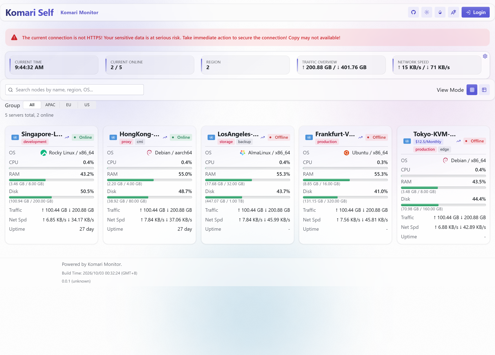
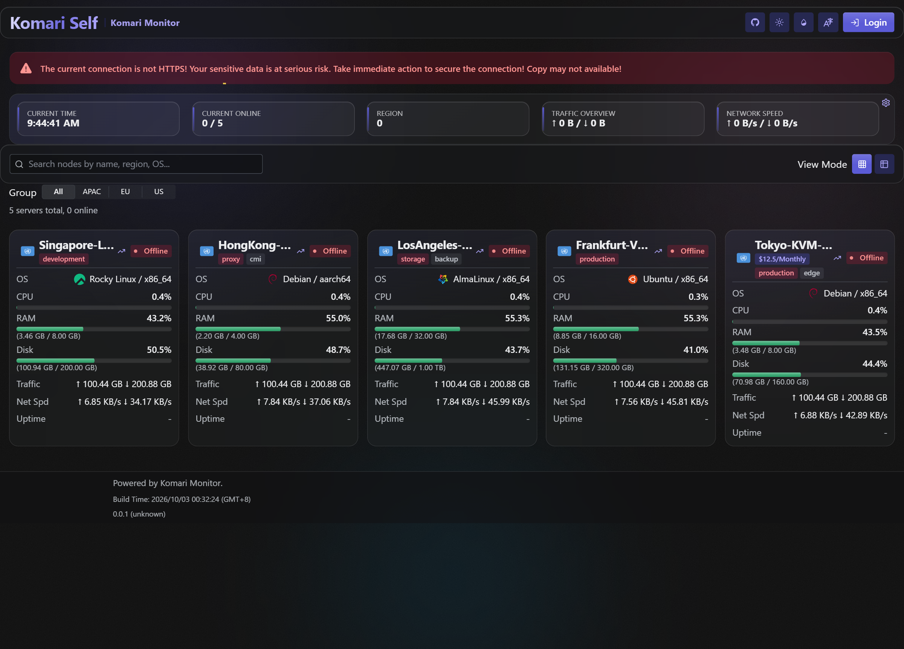
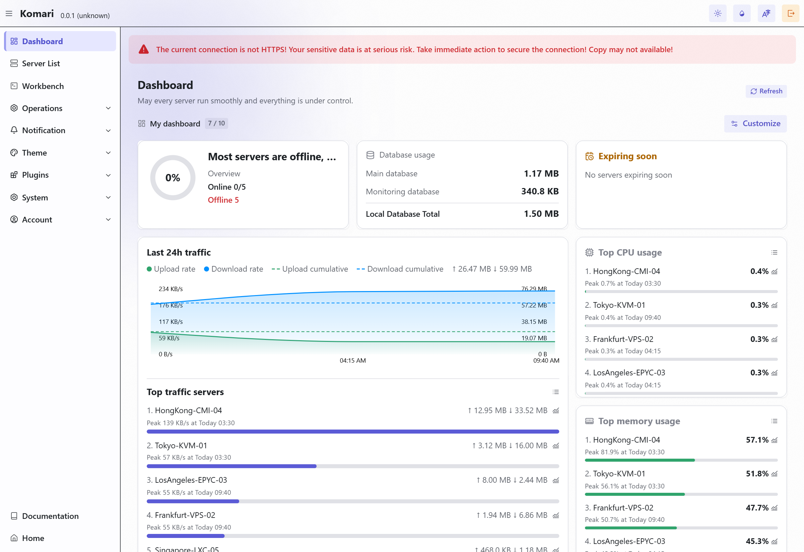
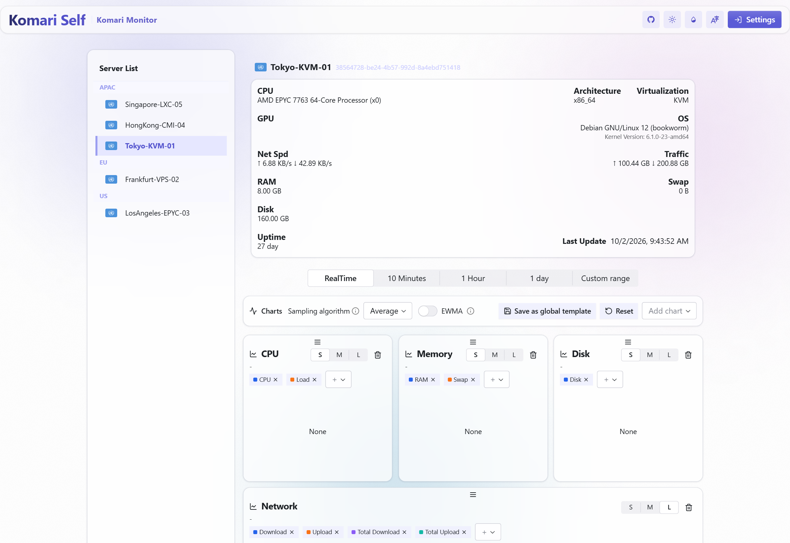

# Komari Self —— 界面美化分支

本仓库是 [komari-monitor/komari](https://github.com/komari-monitor/komari) 的个人分支，
在原版后端之上对**前端界面**做了一轮系统性视觉打磨，并把前端源码与构建产物一并放进仓库：
克隆后直接 `go build` / `docker build` 就能得到一个界面美化过的完整 Komari，无需先构建前端。

上游的 README、许可证与版权声明保持原样，本仓库仅供个人自用。

## 目录约定

| 路径 | 说明 |
| --- | --- |
| `frontend/` | 美化后的前端源码快照（React 19 + Vite 6 + Tailwind v4 + Radix Themes），上游为 `komari-monitor/komari-web` |
| `web/public/defaultTheme/dist.tar.zst` | 前端构建产物归档，由 `go:embed` 内嵌。**已提交**，因此克隆后不必先构建前端 |
| `web/public/defaultTheme/komari-theme.json` | 默认主题元数据 |
| `scripts/build-default-theme.mjs` | 把 `frontend/dist` 打包成上面的 `dist.tar.zst`（纯 Node，不依赖 zstd CLI） |
| `plugins/komari-ui-polish/` | 同一套视觉层的 **Komari 插件**版本：装到任意 Komari 实例即可生效，无需改后端或重建前端 |
| `plugins/market/v1.json` | 插件市场源清单，后台添加该 URL 即可安装 / 更新插件（发布时生成） |
| `scripts/build-plugin.mjs` | 构建插件：由 `src/` 生成内嵌样式表的 `script.js`，再打成可上传的 zip（纯 Node，不依赖 zip CLI） |
| `scripts/sync-theme-css.mjs` | 把插件里的样式层同步到 `frontend/src/theme-polish.css`（插件是规范来源，两份不手改） |
| `docs/screenshots/` | 界面预览截图（本分支的默认主题 + 插件版本各一组） |

## 界面预览

| 公开首页（亮色） | 公开首页（暗色） |
| --- | --- |
|  |  |

| 管理后台 Dashboard | 节点详情 |
| --- | --- |
|  |  |

## 重新构建前端并更新内嵌产物

```bash
cd frontend
npm install
npm run build            # 输出 frontend/dist
cd ..
node scripts/build-default-theme.mjs      # 默认读取 frontend/dist，写入 web/public/defaultTheme/dist.tar.zst
go build -o komari .                      # 或 docker build
```

`scripts/build-default-theme.mjs` 会检查 `frontend/dist/index.html` 是否存在，缺失即报错退出；
产物大小会在结束时打印出来。
## 作为插件使用（推荐给别人的方式）

上面那套视觉层同时做成了一枚 Komari 插件，装到**任意** Komari 实例即可生效 ——
不需要本仓库的后端改动，也不需要重建前端：

```bash
node scripts/build-plugin.mjs      # 生成 plugins/komari-ui-polish/dist/ui-polish-1.1.0.zip
```

然后在后台 → 插件 → 上传该 zip → 批准权限（只申请 HTML 注入）并启用。
也可以在后台把 `plugins/market/v1.json` 添加为市场来源，一键安装与更新。
插件把样式注入到每个 HTML 响应的 `</head>` 之前，因此在同等优先级下覆盖打包样式表，
并且只注入 CSS、**不注入 DOM**。全部开关都在后台的插件配置页里，保存后插件自动重载：
背景模式与自定义背景图（亮暗两张 / 任意 CSS 背景值 / 铺排 / 模糊 / 调暗 / 颗粒）、
毛玻璃导航栏与悬浮形态、卡片与弹层层次、密度、圆角、表格、滚动条、加载动画。
细节见 [`plugins/komari-ui-polish/README.md`](plugins/komari-ui-polish/README.md)。

## 这一轮界面美化改了什么

设计层集中在新增的 `frontend/src/theme-polish.css`（在 `@radix-ui/themes/styles.css`
之后加载），其余只是少量 token 与组件级微调。**没有改动任何业务逻辑、接口与数据结构。**

1. **背景系统（1.1 的重点）**：五种模式 —— `aurora`（强调色染底 + 三团缓慢漂移的模糊光晕，默认）、
   `wash`（静态渐变）、`image`（**你自己的背景图或渐变**）、`solid`、`theme`（交还给主题自带背景）。
   背景画在 `.theme-root` / `.km-layout` 的伪元素上，因此继承主题的强调色与灰阶（本分支里是编译进前端的固定值；
   在插件里则由配置页提供）。
2. **悬浮毛玻璃导航栏**：导航栏脱离视口顶边，变成圆角玻璃岛，配 20px 模糊与顶部内高光。
3. **面板层次**：所有面板顶部加一道内高光，卡片像是被上方照亮而不是一块平板；密度与圆角各有几档。
4. **卡片与概览**：节点卡悬停上浮 + 强调色描边；概览指标改为左侧带强调条的小卡片；
   搜索/分组工具条改为玻璃面板。
5. **用量条**：轨道加内阴影，填充加高光渐变，数值改用等宽数字（tabular-nums）避免跳动。
6. **表格**：`components/ui/table.tsx` 的表格卡片化 —— 描边、圆角、阴影、半透明吸顶表头、行悬停反馈。
7. **加载态**：替换原版四色（红/蓝/绿/黄）旋转指示器，改为单一强调色圆环 + 淡色轨道，并垂直居中。
8. **缺陷修复**：`PriceTags` 在 `expired_at` 为空字符串 / `null` / 不可解析时，
   会渲染出 `NaN day` 徽章；现在这种情况视为「无到期时间」，不再渲染到期徽章。
9. **细节**：滚动条细化（悬停变强调色）、弹层/对话框统一圆角与阴影、遮罩模糊、
   文本选中色、`prefers-reduced-motion` 下关闭位移动画。

## 说明

- `frontend/` 是快照，不跟随上游自动更新；需要同步上游时手动对比合并。
- 上游 `.gitignore` 默认忽略 `web/public/defaultTheme/*`，本分支用 `git add -f` 强制纳入了
  `dist.tar.zst` —— 这是“克隆即可构建”的前提，改动前端后记得重新生成它。
- `frontend/src/theme-polish.css` 与 `plugins/komari-ui-polish/src/ui-polish.css` 是**同一份样式**：
  插件那份是规范来源（调色、验证都在它上面做），本分支这份由 `node scripts/sync-theme-css.mjs` 生成，
  文件头也标注了「不要手改」；`--check` 可以检查两边是否同步。
- 插件 README 里记了四条踩过的实现要点（背景必须画在 `.theme-root` 内、特异性要用 `:is()`、
  配置变量要落在 `.theme-root` 且排在最后、进场动画别用 `both` 填充），改样式前值得先看一眼。
