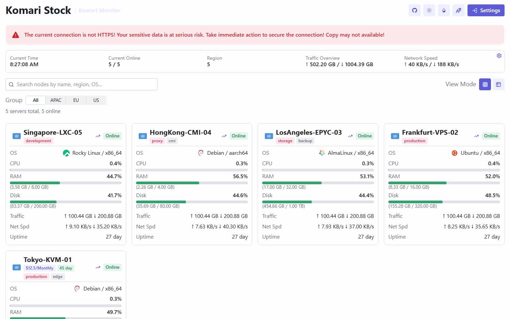
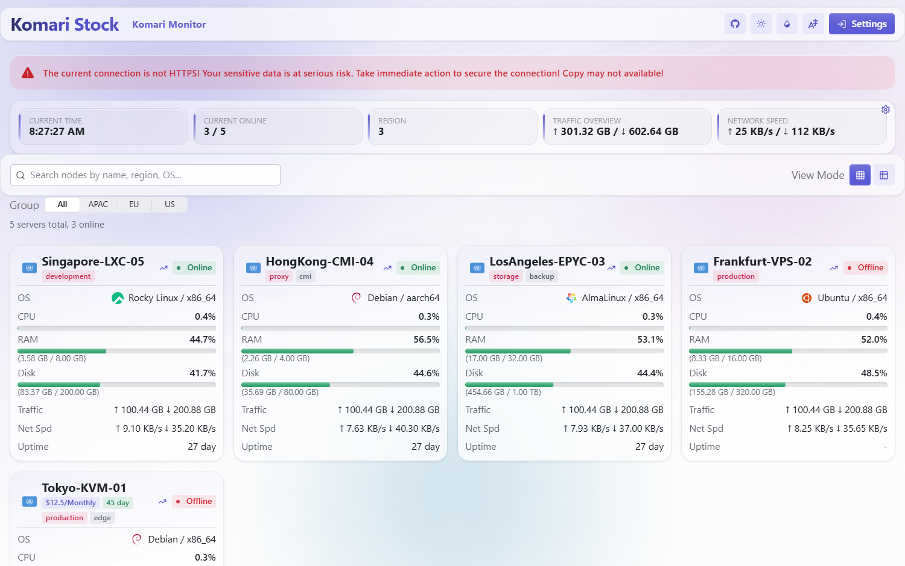
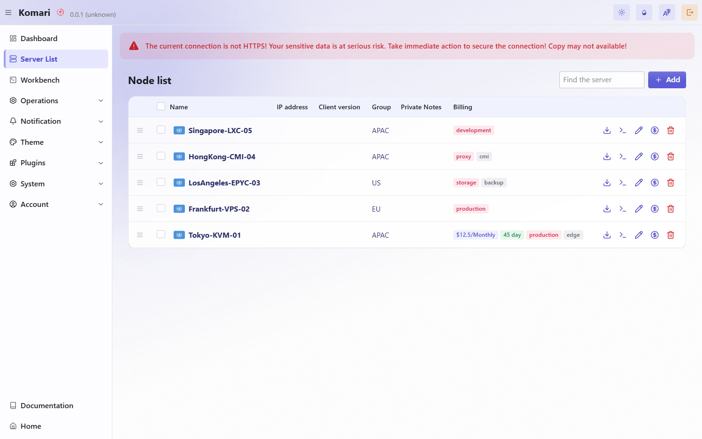
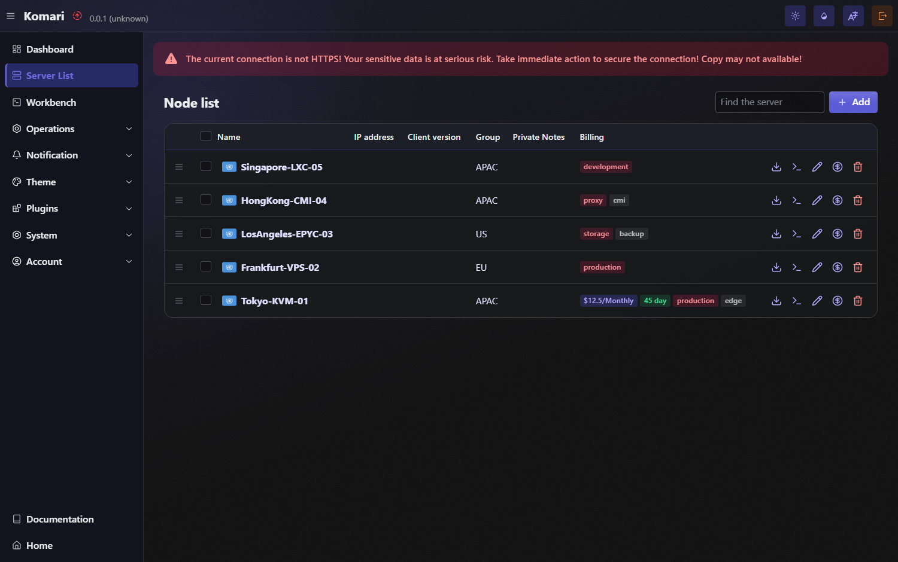
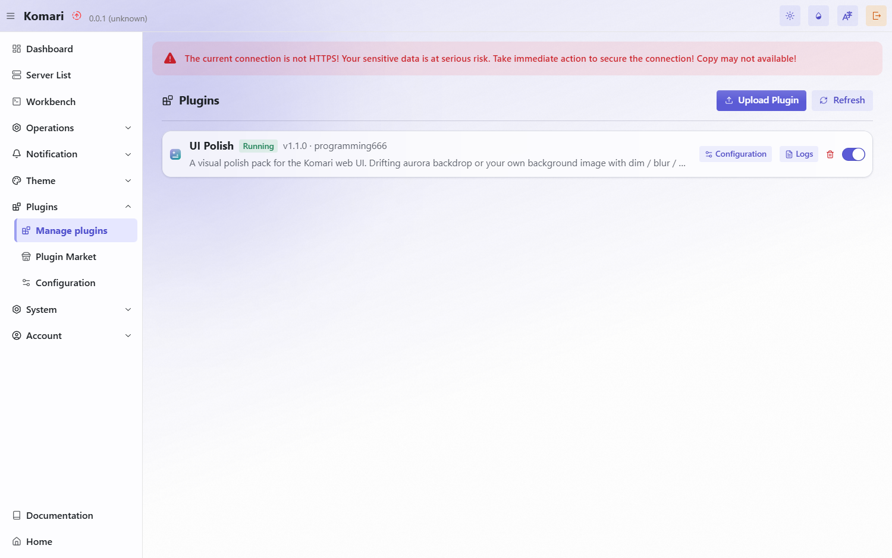
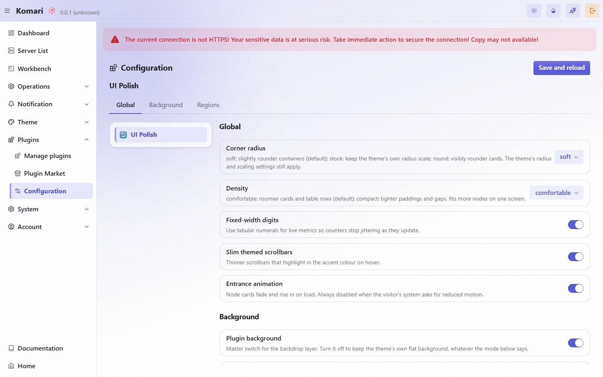
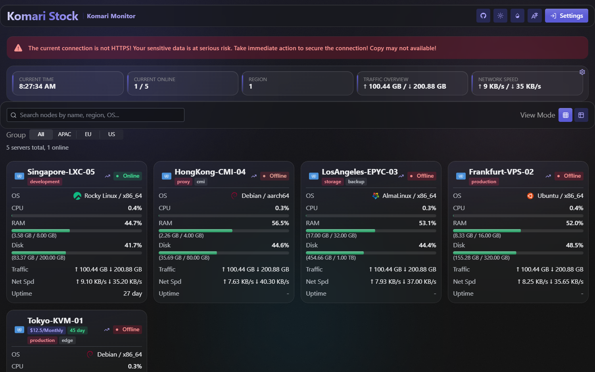
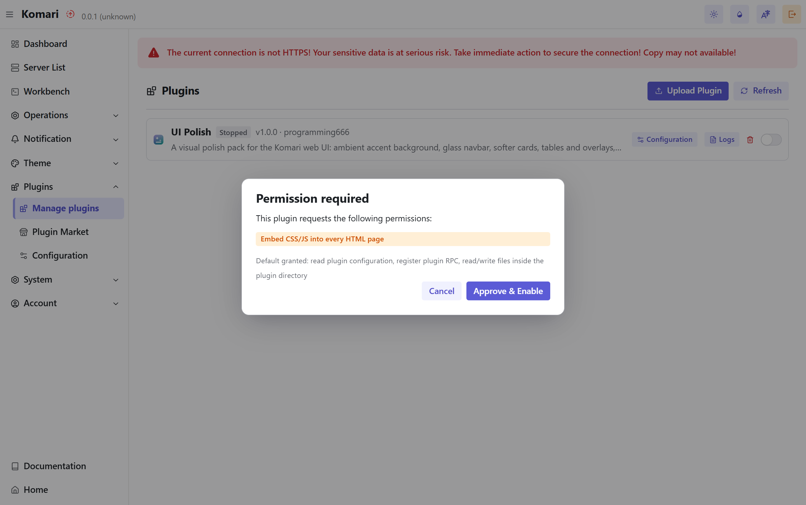

# UI Polish — Komari 界面美化插件

把 Komari 网页界面整体换一套观感的**前端插件**：跟随主题色的流动氛围背景（或换成你自己的背景图）、
悬浮毛玻璃导航栏、更有层次的面板与表格、主题化滚动条、单一主题色的加载动画。

- **只注入 CSS + 一小段生成样式**，不改动任何布局逻辑、接口或数据结构，也不注入 DOM
- **不需要重新编译前后端**，装到任意 Komari 实例（含官方构建）即可生效
- 前台、后台统一生效；全部开关在「后台 → 插件 → 配置」里实时调整，保存即重载
- 只申请 `allowHTMLInject` 一项权限，不申请路由、Node.js、执行、监听等任何权限

```
short      ui-polish
version    1.1.0
权限        allowHTMLInject（仅此项）
入口        script.js
来源        src/entry.js + src/ui-polish.css
```

## 效果预览

以下截图取自一台**未修改的上游前端**（把本仓库的美化改动 stash 掉后重新构建，编译出 `km_stock.exe`），
插件是从市场源安装的；同一批数据、同一时间。

| 原版（上游） | 装上 UI Polish |
| --- | --- |
|  |  |

| 后台节点列表 | 后台节点列表（暗色） |
| --- | --- |
|  |  |

| 插件已装并运行 | 插件配置页 | 首页（暗色） |
| --- | --- | --- |
|  |  |  |

## 1.1 的新东西

1. **背景系统**（这次的重点）：五种模式、可自定义背景图，见下节。
2. **悬浮毛玻璃导航栏**：导航栏脱离视口顶边，变成一张圆角玻璃岛（`chrome: floating`，默认），
   这是"新观感"里最显眼的一处。
3. **面板层次**：所有面板顶部加一道内高光，卡片像是被上方照亮而不是一块平板（`depth`）。
4. **密度可调**：`comfortable` / `compact`，一次调紧卡片与表格行的内边距。
5. **表格升级**：半透明吸顶表头 + 强调色底，行悬停反馈。
6. **光晕动效**：三团超大的模糊色晕缓慢漂移，只动 `transform`，因此全部留在合成层上；
   关掉即静态，系统开启「减少动态效果」时也自动静态。

## 背景：五档模式

| 模式 | 说明 |
| --- | --- |
| `aurora` | **默认**。强调色染底 + 三团缓慢漂移的模糊光晕，有暗色/亮色各自的浓度 |
| `wash` | 静态的强调色渐变（1.0 的观感） |
| `image` | **你自己的背景图或渐变**：支持图片 URL、路径、`data:` URI，或用「背景 CSS」直接写 `linear-gradient(...)` / `radial-gradient(...)` 等任意 CSS 背景值 |
| `solid` | 纯色平面 |
| `theme` | 什么都不画，完全交还给主题自带的背景（插件只在其它模式接管背景） |

围绕背景图的四个旋钮：

- **亮暗两张**：`backgroundImage` / `backgroundImageDark`（暗色留空则沿用亮色那张），
  或用进阶字段 `backgroundCss` / `backgroundCssDark` 写任意 CSS；
- **铺排方式** `backgroundFit`：`cover`（默认，铺满）/ `contain`（完整显示）/ `repeat`（平铺小图案）；
- **模糊** `backgroundBlur`：0–60 px，让背景柔化，前景文字更好读；
- **调暗** `backgroundDim`：0–85%，给背景蒙一层纱（亮色为白、暗色为黑），
  照片太花时调大，想看更多画面就调小。

另外 `grain`（颗粒质感）会在背景上叠一层极淡的噪点，避免大面积渐变显得像塑料。

> 插件接管背景时，会先让应用自带的几层画布变透明，并让 `.km-layout` 上的主题背景图让位，
> 这样调暗/模糊/颗粒/亮暗区分才能作用于你的图片。选 `theme` 模式则完全不插手。

## 配置项

后台 → 插件 → 配置（保存后插件自动重载，样式即时更新）：

| 分组 | 键 | 类型 | 默认 | 说明 |
| --- | --- | --- | --- | --- |
| 全局 | `radius` | select | `soft` | 圆角：`soft` 略圆 / `stock` 沿用主题 / `round` 明显更圆 |
| | `density` | select | `comfortable` | 密度：`comfortable` / `compact` |
| | `numerals` | switch | 开 | 实时指标用等宽数字，更新时不抖动 |
| | `scrollbar` | switch | 开 | 更细的滚动条，悬停变主题色 |
| | `motion` | switch | 开 | 卡片进场淡入上浮 |
| 背景 | `ambient` | switch | 开 | **背景总开关**，关掉即保留主题自带背景 |
| | `background` | select | `aurora` | 模式：`aurora` / `wash` / `image` / `solid` / `theme` |
| | `backgroundImage` | string | 空 | 亮色背景图（URL / 路径 / `data:` URI） |
| | `backgroundImageDark` | string | 空 | 暗色背景图，留空沿用亮色 |
| | `backgroundCss` | string | 空 | 亮色背景 CSS（优先于图片，可写渐变/多层） |
| | `backgroundCssDark` | string | 空 | 暗色背景 CSS，留空沿用亮色 |
| | `backgroundFit` | select | `cover` | `cover` / `contain` / `repeat` |
| | `backgroundBlur` | number | 0 | 背景模糊 0–60 px |
| | `backgroundDim` | number | 18 | 背景调暗 0–85% |
| | `ambientIntensity` | select | `standard` | 氛围浓度：`subtle` / `standard` / `strong` |
| | `auroraMotion` | switch | 开 | 光晕是否流动 |
| | `grain` | switch | 开 | 颗粒质感 |
| 区域 | `glass` | switch | 开 | 毛玻璃导航栏 / 工具条 / 页脚 + 渐变标题 |
| | `chrome` | select | `floating` | `floating` 悬浮玻璃岛 / `attached` 贴顶整宽条（同原版） |
| | `depth` | switch | 开 | 面板内高光层次 |
| | `elevation` | switch | 开 | 卡片 / 节点卡 / 用量条 / 弹层的阴影、圆角与悬停上浮 |
| | `tables` | switch | 开 | 表格卡片化 |
| | `adminShell` | switch | 开 | 后台内容区透明，与前台背景一致 |
| | `loader` | switch | 开 | 四色转圈 → 跟随主题色的圆环 |

## 安装

### 1. 后台上传（推荐）

从 [Releases](https://github.com/programming666/komari-self/releases) 下载 `ui-polish-1.1.0.zip`
（或直接用仓库里的 `plugins/komari-ui-polish/dist/ui-polish-1.1.0.zip`），
后台 → **插件** → 上传插件。

打开插件开关时会弹出 **Permission required** 对话框，里面**只有一项** ——
`Embed CSS/JS into every HTML page`，点 **Approve & Enable** 即可；
除此之外它只用默认权限（读自身配置、注册插件 RPC、在自身目录内读写文件）。



### 2. 插件市场

后台 → **插件** → 市场 → 市场来源 → 新增，名称随意，URL 填：

```
https://raw.githubusercontent.com/programming666/komari-self/main/plugins/market/v1.json
```

保存后市场里会出现 UI Polish，可一键安装与更新（该文件由本仓库发布时生成，
`download` 指向同一 Release 里的 zip，`sha256` 用于校验）。

### 3. 手动放置

把这几项复制到 Komari 数据目录下的 `plugin/ui-polish/`，再在后台启用：

```
<数据目录>/plugin/ui-polish/
├── komari-plugin.json   # 清单：名称、版本、图标、权限、配置项
├── script.js            # 入口（由 src/ 生成，含内嵌样式表）
├── icon.svg
└── README.md
```

## 工作原理

1. `script.js` 加载时通过 `server.getConfig()` 读取配置；
2. 把内嵌的样式表按 `/* @section:name */` 标记拆成若干段，只取启用的那些；
3. 按配置生成一小段 `--km-*` 变量（圆角、密度、氛围浓度、背景尺寸/调暗/模糊、亮暗两套光晕浓度）；
4. 通过 `server.injectHTML(head, body)` 把结果作为 `<style id="komari-ui-polish">` 注册进
   HTML 注入点，Komari 会把它插到每个 HTML 响应的 `</head>` 之前 —— 位于打包样式表**之后**，
   同等优先级下后者覆盖前者，所以无需重建前端即可改变外观。

注入的只有 CSS，**没有 DOM**。背景画在 `.theme-root::before` / `.theme-root::after` 与
`.km-layout::before` / `::after` 这四个伪元素上，原因见下。

## 四个实现要点（都是踩过的坑）

1. **背景必须画在 `.theme-root` 内部**。主题的颜色变量（`--accent-9`、`--gray-1`…）都定义在
   `.theme-root` 上。最初把背景层插在 `<body>` 下（`.theme-root` 之外），那里所有变量都未定义，
   `color-mix(in oklab, var(--accent-9) …, transparent)` 因此整条失效，`background-image`
   的计算值变成 `none` —— 插件"装上了但什么也没发生"。改用伪元素后变量天然可用，也不再需要注入 DOM。
2. **特异性要压过 Radix**。Radix 用 `.rt-BaseCard.rt-variant-surface`（两个类）画卡片背景与描边，
   而 `:where()` 的特异性为 0，所以 `.rt-BaseCard:where(.rt-variant-surface)` 根本赢不了。
   插件里一律用 `:is()`，与 Radix 打平后靠"注入在后面"取胜。
3. **配置变量要落在 `.theme-root` 且排在最后**。`core` 段为这些名字声明了回退值在 `.theme-root` 上，
   而"元素自身声明的值胜过从 `html` 继承的值"——所以配置块必须写在 `.theme-root` 上，
   并且**追加在所有段之后**，否则会被回退值盖掉（症状：改密度/圆角没反应）。
4. **进场动画不要用 `both` 填充**。仪表盘每次推送指标都会重挂载卡片，`both` 会把新挂载的卡片
   钉在 `opacity: 0` 的关键帧上，网格会周期性"闪没"。去掉填充模式后，卡片照常淡入，但永远不会卡在不可见。

另外构建脚本会做一次结构自检（`validateCss`）：花括号是否平衡、有没有声明掉在规则块之外。
这条是补上一个真实事故——某次替换编辑吞掉了 `--km-artwork` 规则的选择器行，
声明变成游离文本被解析器丢弃，压缩包依旧能装、能启用，只是背景再也不出现。

## 目录结构

```
komari-ui-polish/
├── komari-plugin.json        # 清单
├── src/
│   ├── entry.js              # 入口逻辑（读取配置、拼装、注入）
│   └── ui-polish.css         # 样式层，按 @section 标记分段
├── script.js                 # 构建产物：内嵌样式表 + 入口逻辑，插件实际加载的文件
├── icon.svg
├── README.md
└── dist/
    └── ui-polish-1.1.0.zip   # 可上传的安装包
```

改动样式或逻辑后重新构建：

```bash
# 在仓库根目录
node scripts/build-plugin.mjs
```

脚本会先由 `src/` 生成 `script.js`（并用 `node --check` 与 CSS 结构自检把关），
再打成 `dist/ui-polish-<version>.zip`（清单位于压缩包根目录），最后打印 sha256。

## 验证情况

在**未修改的上游前端**上实测（`git stash` 掉美化改动后重新构建的 dist，编译出 `komari-stock.exe`，
监听 127.0.0.1:25775），逐项对比关闭/开启插件与各档配置的计算样式。32 项检查全绿，摘录：

| 观察项 | 结果 |
| --- | --- |
| 注入的 `<style>` | 27145 字节 / 114 段规则 |
| 注入的 DOM | 无；`html`/`body`/`#root`/`.theme-root`/`.km-layout` 背景透明 |
| `.theme-root::before` 图层 | 颗粒 + 遮罩 + 图案 三层合成（`gradients=2`，含 `data:image/svg`） |
| 遮罩 | `rgba(255,255,255,0.18)`，调暗设 45% 时变 0.45 |
| 光晕 | `.theme-root::after` / `.km-layout::before` 各一团 `radial-gradient`，动画 `km-drift-1 / 46s` |
| 导航栏 | `position: sticky`，`top: 10px`，圆角 17.6px，`blur(20px) saturate(1.75)` |
| 节点卡 | 圆角 18.7px、三层阴影（含内高光）；圆形模式下 26.4px |
| 数字 | `tabular-nums` |
| 自定义背景 | 裸 URL 被包成 `url("data:image/png;base64,…")`；`linear-gradient(120deg,…)` 原样生效；`picsum.photos` 图片按 cover 铺满；`repeat` 时 `auto/repeat` |
| 开关 | 关总开关→图层消失；关光晕动效→`animation-name: none` 但仍绘制；关颗粒→SVG 层消失而渐变仍在 |
| 恢复默认 | 注入字节数与初始**逐字节一致** |

市场安装链路（本机无直连公网，走 socks5 代理）也已跑通：把上面的 `v1.json` 添加为市场来源后，
目录里出现 `ui-polish` 且 `installable: true`，一键安装成功，后台插件日志：

```
[plugin] loaded ui-polish
[ui-polish] injected 27 KiB of CSS; background: aurora; sections: numerals, backdrop, bgAurora, grain, auroraMotion, glass, chrome, elevation, depth, tables, adminShell, scrollbar, motion, loader
```

安装后的文件与发行包内的条目**逐字节一致**；发行包哈希同时等于市场清单里的 `sha256`
（市场安装时服务端会校验该哈希，不符即拒绝安装）。

打包是**可复现**的：ZIP 条目使用固定时间戳（可用 `SOURCE_DATE_EPOCH` 覆盖），
源文件与文本条目都会先把 CRLF 归一成 LF，因此在 Windows（`core.autocrlf=true`）与
Linux 检出里构建得到同一个 zip 与同一个哈希。提交前可自查：

```
$ node scripts/build-plugin.mjs --check
ui-polish 1.1.0 — consistency check
  rebuilt  <sha256>
  dist     <sha256>  ok
  catalog  <sha256>  ok
  release  <sha256>  (compare with the asset at the catalog's download URL)
```

## 发布新版本

1. 改 `src/` 里的样式或逻辑，并把 `komari-plugin.json` 的 `version` 加一（例如 `1.2.0`）；
2. `node scripts/build-plugin.mjs` 生成新的 `dist/ui-polish-1.2.0.zip`，记下它打印的 sha256；
3. 在 GitHub 上打一个 Release（tag 形如 `ui-polish-v1.2.0`），把该 zip 作为附件上传；
4. 生成并提交更新后的市场源文件：

   ```bash
   node scripts/build-plugin.mjs --market plugins/market/v1.json \
     --download https://github.com/programming666/komari-self/releases/download/ui-polish-v1.2.0/ui-polish-1.2.0.zip
   ```

   后台已添加该市场源的实例随即能看到新版本。`sha256` 必须与实际发行的 zip 一致 ——
   安装时服务端会校验它，而打包已固定时间戳并把行尾归一，所以同一份源码在任何机器上构建都得到
   同一个 zip 与同一个哈希。
5. 最后用 `node scripts/build-plugin.mjs --check` 自查一次。**README 也在包里**，
   所以改完文档要重新构建再提交，否则包里会留着一份旧文档。

> 注：本仓库的 Release 同时会被上游 CI 挂上 Komari 的应用二进制；插件包与它们互不影响。
> 替换插件附件时按**文件名**定位 asset id（不能按下标取，列表里还有那些二进制）。

## 已知边界

- 只注入 CSS，因此**无法**修复需要改代码的问题。例如节点价格标签在到期时间字段为空时
  会渲染出 `NaN day` 徽章，属于组件逻辑，已在
  [komari-self](https://github.com/programming666/komari-self) 的前端改动里修掉，
  插件层面不做 DOM 劫持。
- 光晕用伪元素实现，所以如果哪天上游也用掉了 `.km-layout::before/::after`，两者会打架
  （真出现的话把 `auroraMotion` 关掉即可，或改成独立注入的图层）。
- 与"把样式直接编进前端"的另一条路子可以共存：见仓库根的 `SELF-FORK.md`。
